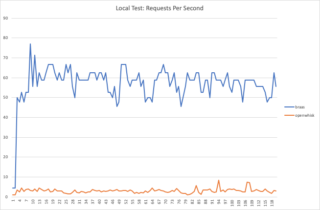

<style>
    video {
        width: 500px;
        align: center;
    }

    .center {
        align-items: center;
        display: flex;
        flex-direction: column;        
    }
</style>

# Using a Web Browser as an execution engine on a server

If you want to build a modern web app, you typically need to use a few different tools: one set for the front-end, and another for the back-end. In addition, you would need to learn and use a different API (and often even a different programming language) for the back-end. However, the Web API is a rich and stable API, and the web browser is a stable, powerful and secure execution environment. So why then can we not use this execution environment for our back-end too? This is the question we asked ourselves at [IBM Research](https://research.ibm.com/labs/africa/), so we decided to try running a browser on the server. This turned out to work much better than we had anticipated!

## Browser-to-Browser communication

Our first challenge was: how do we get many browsers to talk to one or more browsers on the server? [The solution](https://github.com/IBM/browser-functions/blob/master/docs/index.md#how-does-it-work) we came up with is simple: run a regular web server, and have it forward the requests to the *server browser* (which we will call the *Execution Engine*), which then processes the requests in tabs (i.e. loads the web page and runs a `main()` JavaScript function), and returns the results back. We created a *controller tab* that runs on the execution engine, which talks to the web server using a WebSocket, and then opens and closes (or re-uses) tabs on-demand. This simple setup was all that was needed to get the system functional.

<p class="center">
    <iframe width="500" height="281" src="https://www.youtube.com/embed/M6W0YTaAlX8" frameborder="0" allow="accelerometer; autoplay; encrypted-media; gyroscope; picture-in-picture" allowfullscreen></iframe>
    <i>A desktop browser executing many functions in multiple tabs</i>
</p>

## Performance

Initially, we were concerned about how this might perform. After all, browsers are built to run on desktops, and hence to not utilize too many resources, so as to keep the rest of the system responsive. On a server however, we'd like maximum hardware utilization so that we can optimize the throughput and response times. So we built a proof-of-concept, and ran some performance tests. We ran the execution engine in [headless](https://developer.mozilla.org/en-US/docs/Mozilla/Firefox/Headless_mode) mode, which makes it perform more like a back-end server. When we saw response times of around 20 milliseconds for a full round-trip function execution, our concerns were eased! Some more performance testing on a laptop showed that, in general, performance is about [10 times better](https://github.com/IBM/browser-functions/blob/master/docs/performance.md) than a container-based serverless platform running the same function, on the same machine.

<p class="center">
    
    <i>Throughput on a MacBook Pro 2015. Blue line represents Browser Functions</i>
</p>

## Surprising benefits


What we'd basically ended up with is a performant [serverless](https://serverless-stack.com/chapters/what-is-serverless.html) platform, which we are calling Browser Functions, that can execute web front-end code on the back-end. As we explored this idea further, we realized some surprising benefits to this platform:


We can now do full stack development using just Web APIs. Need to [read/write network resources](https://github.com/IBM/browser-functions/blob/master/functions_root/examples/files/storage/hitcounter.js)? Use the `fetch` API. Need to [cache some data](https://github.com/IBM/browser-functions/tree/master/functions_root/examples/files/caching)? Use `localStorage`. Need to [blur an image](https://github.com/IBM/browser-functions/tree/master/functions_root/examples/files/image_processing)? Use a CSS filter on an `img` tag. Need to [manage sessions](https://github.com/IBM/browser-functions/tree/master/functions_root/examples/files/cookie)? Use cookies. Need multi-threading? Use `Web Workers`. Need [native compiled speed](https://github.com/IBM/browser-functions/tree/master/functions_root/examples/files/webassembly_c) (or a language other than JavaScript)? Use WebAssembly. 


We already have all the tools needed to develop and debug the back-end code on our local development machines: the desktop web browser! We can develop locally, then upload the code to the server, and it just works.


The server is lightweight and [easy to install](https://github.com/IBM/browser-functions/blob/master/docs/install.md) and maintain. Running tens of thousands of simple requests on the server uses less than 2Gb of RAM.


We benefit from the proven, tested, and constantly updated security that the browser vendors have developed to protect one website from another. We use *domain isolation* to leverage this security by running each application in a separate domain.


We have hardware acceleration in the form of WebGL (if a 3D graphics card is available). We can leverage this by using JavaScript libraries that use WebGL, such as gpu.js or Tensorflow.js.


We have free, distributed "package management" in the form of `<script>` or `<link>` tags that can pull content directly from CDNs. Thanks to the CDNs, the initial load of external resources are fast, and the execution engines will then cache these resources for subsequent invocations. Versioning is supported, as is integrity checking, via [subresource integrity](https://hacks.mozilla.org/2015/09/subresource-integrity-in-firefox-43/).


Any modern browser could run as an execution engine. We use Firefox or Chrome/Chromium as they support headless mode, and we can leverage Puppeteer support on the server for automation.


We can add more execution engines to a single web server instance simply by opening a web browser to the server URL. The web server automatically load balances across all connected execution engines. Instant scaling!


These execution engines could be running anywhere, including inside our private network, thus enabling a hybrid-cloud approach. We could even run them on desktops/laptops/Raspberry Pi's.

<p class="center">
    <iframe width="500" height="281" src="https://www.youtube.com/embed/3CCXa4M8ogA" frameborder="0" allow="accelerometer; autoplay; encrypted-media; gyroscope; picture-in-picture" allowfullscreen></iframe>
    <i>Managing running browser instances on the server</i>
</p>

## Show me the code

What do browser functions look like? Initially, they were complete web pages with a JavaScript `main()` function that gets called, and its return value returned as the result of the function call. We wanted to make this easier though, so we currently support HTML fragments and pure JavaScript functions that are then automatically embedded into a full web page with the associated HTML5 boilerplate. 


Here is a basic and complete "hello world" JavaScript example:

```javascript
function main() {
    return "Hello, world!";
}
```

To run this function, upload the function file to an existing Browser Functions server (or use the [local development](https://github.com/IBM/browser-functions/blob/master/docs/quickstart.md#local-static-development) tools), and then execute the function by calling it as a REST endpoint:

```
home$ curl https://server/execute/hello/function.js
Hello, world!
home$
```

Browser Functions also provides function arguments, environment variables, ability to set return headers, and more, via a simple [API](https://github.com/IBM/browser-functions/blob/master/docs/api.md).

<p class="center">
    <iframe width="500" height="281" src="https://www.youtube.com/embed/jDPkpXFIp2I" frameborder="0" allow="accelerometer; autoplay; encrypted-media; gyroscope; picture-in-picture" allowfullscreen></iframe>
    <i>Uploading and running a function</i>
</p>


## Use cases


You may be wondering why you wouldn't just run the functions on client browsers instead of on an execution engine. Running the code on a hosted server is useful when you need to:


- protect sensitive credentials from the client, e.g. database login or API keys
- run the function on a trigger, e.g. on a schedule, or via Webhooks
- expose private cloud data to public, i.e. the function runs inside a private network
- work around [CORS](https://developer.mozilla.org/en-US/docs/Web/HTTP/CORS) restrictions, i.e. proxy clients through the server
- have the function be consumed by non-browsers, e.g. mobile apps, embedded devices
- pre-render content for old browsers/embedded devices/smart watches, e.g. render an SVG, return the image
- perform resource intensive computations on the server, e.g. Tensorflow.js inference or GPU.js calculations
- add a caching layer to a rate-limited external API, e.g. twitter


These are just some of the scenarios we thought of, but we're really looking forward to seeing how other developers make use of or build on this platform.


Here's a simple example of how we used Browser Functions in one of our projects. We created a static web site for a product, which included a contact form. We wanted to store the contact form submissions into our CouchDB database.  We didn't want to do this directly from the client browser, because we would need to enable CORS for all origins on our database (reduces security), and we would need to send the authentication tokens (with write access to the database) to the client. So instead, we had our form submit its data to a browser function:

```html
<form action="/execute/form_to_couchdb.html" method="POST">
    <input type="text" name="full_name" value="">
    <input type="text" name="email_address" value="">
    <textarea name="message"></textarea>
    <input type="submit" name="submit">
</form>
```

In our browser function, we grabbed the submitted form data, and posted this into a new document in CouchDB using its REST API, as follows:

```html
<div id="success">
    <b>Success!</b>
    <p>
        Thank you for submitting your message. We will get back to you ASAP.
    </p>
</div>

<div id="failed">
    <b>Failed!</b>
    <p>
        Something went wrong, sorry. Try again later.
    </p>
</div>

<script>
// The form POST data comes through as the args parameter
async function main(args, md) {
    let env = md.env; // environment variables from environment.json
    let res = await addDocument(env.db_url, env.db_key, env.db_token, args);
    if (res.ok) {
        return document.getElementById("success").innerHTML;
    } else {
        return document.getElementById("failed").innerHTML;
    }
}

// Generic function to Add a document to CouchDB. Returns a Promise.
function addDocument(dbUrl, dbKey, dbToken, data) {
    return fetch(dbUrl, {
        method: 'POST',
        headers: {
            'Content-Type': 'application/json',
            'Authorization': 'Basic ' + btoa(dbKey + ":" + dbToken)
        },
        body: JSON.stringify(data)
    }).then(function (response) {
        return response.json();
    })
}
</script>
```

The end result was simple and very quick to implement. In addition, we implemented a daily digest e-mail of contact details submitted, which is a browser function that we called from a `cron` job (i.e. on a timer). This function loaded the documents saved since the last digest run from CouchDB, created a DOM rendering of the content suitable for an e-mail, grabbed the `innerHTML` of that rendering, and sent that off as an email using an e-mail service.


## Try it out, and contribute


We believe we've barely scratched the surface of what's possible when using the Web API on the back-end. For example, we have yet to explore how we might leverage API's such as WebAssembly, WebRTC, WebUSB, WebSocket, or many other capabilities of the web browser; how browser extensions/add-ons or even Puppeteer could be used as a mechanism to manage running worker tabs (CPU limits, RAM limits, billing, etc); or performance optimization using browser settings, command-line switches, or custom browser builds. This is why we've open sourced Browser Functions, so that you can get involved in exploring and extending this platform with us.


The source code and documentation is available at: [https://github.com/IBM/browser-functions](https://github.com/IBM/browser-functions)