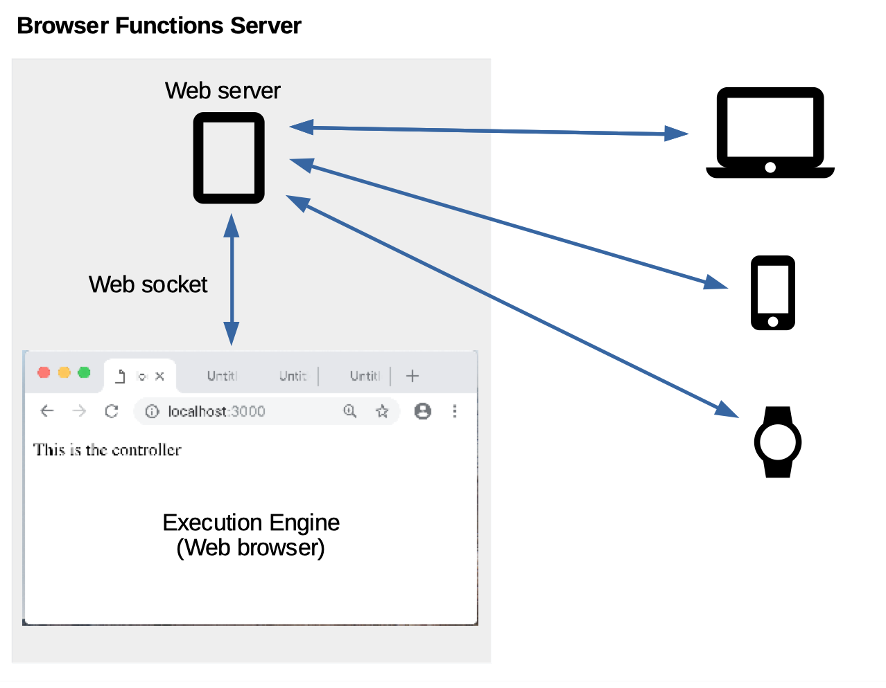

Browser Functions
=======

[TOC]

# What is it?

Browser Functions is a platform for running functions inside a browser, on a server. Any code executable by a modern browser, such as HTML, JavaScript, CSS, or even Web Assembly, can be executed inside Browser Functions. The functions are actually executed within tabs inside a browser (e.g. Chrome or Firefox). This means that front-end code can be used directly in the backend.

# Why would you use it?

Browser Functions can be used as a serverless platform. If you are hosting your own serverless solution, Browser Functions may provide a platform that is cheaper to host compared to standard serverless platforms. It is quick and easy to get [up and running](?install.md), and is very lightweight compared to other solutions, leading to much [better performance](?performance.md) (or conversely, much lower resource utilization). Unlike other serverless platforms, there isn't a cold-start penalty, so there isn't a need to keep resource-hungry containers running.

As a developer, you may consider using Browser Functions if you are familiar with web front-end development. You can use the same web API's and code you use on the front-end in Browser Functions to create your own RESTful API's - all that is required is a `main()` JavaScript function to return the results. Best of all, you can take advantage of the latest web API's, since Browser Functions uses very recent versions of Chrome and Firefox.

You may be wondering why you wouldn't just run those functions on the client browsers. Running the code on a hosted server is useful when you need to:

- hide credentials (e.g. database login or API keys) from the client
- run the function on a trigger (e.g. on a schedule, or via Webhooks)
- expose private cloud data to public (i.e. the function runs inside a private network)
- work around [CORS](https://developer.mozilla.org/en-US/docs/Web/HTTP/CORS) restrictions (i.e. proxy clients through the server)
- have the function be consumed by non-browsers (e.g. mobile apps, embedded devices)
- pre-render content for old browsers, embedded devices, smart watches, etc. (e.g. render an SVG, return the image)
- add a caching layer to a rate-limited external API (e.g. twitter)

See the *benefits* section below for more.

# How does it work?

Browser Functions uses "containers" to execute your code, where the containers are browser tabs. This makes them fast and lightweight. To co-ordinate the jobs and the browser instances, Browser Functions contains a *server* (written in NodeJS) which launches a *controller* into each browser. The controllers manage the worker tabs and communicates back to the server via a web socket.



Requests come into the server, which then forwards it onto an available browser controller. The controller launches the request into a free tab, calls the `main()` function, and returns the result back to the server, which then forwards it back to the client. In order to maintain isolation between different applications, each application is given a different domain name (which is a sub-domain of the server's domain), e.g. `app1.browserfunctions.com`.

# What are the benefits?

Using a browser on the server offers many benefits over current serverless platforms:

## Performance

A browser tab opens in about 20 milliseconds and uses much less memory than a typical docker container. Browser Functions takes this further and keeps *worker tabs* open and ready to accept jobs. This means that there isn't a *cold start* penalty, and once the browser has cached the resources of the function, subsequent executions are even faster. You can see some performance benchmarks and read more about performance of Browser Functions in the [performance](?performance.md) section.

## Security

Applications in Browser Functions are isolated from one another via the browser's strict same-origin policy. Each application executes in a different domain, leveraging the same security that protects your banking tab from a malicious site running in another tab.

## Instant scalability

Every application registered on a Browser Functions server can elect to make use of it's own custom browser instance(s), which can be running anywhere (as long as it can connect to the server). Need more capacity? Simply spin up a browser instance on any machine and connect it to the server using the application's custom controller URL. Requests to that application will now be load balanced onto the custom browser instances.

## Keep private functions private

You can deploy Browser Functions inside your private cloud, or simply run the execution browser(s) within your private cloud. You can choose to run sensitive functions within your private cloud, but public functions on the public cloud.

## No vendor lock-in

There is no need to learn a new API - your code is the same code that runs on all modern web browsers.

## Hardware acceleration

Modern browsers feature hardware-accelerated capability, such as WebGL (which takes advantage of GPU hardware), and Web Assembly (which provides native execution speed on the CPU). Your functions can make use of this, for example by performing [GPU-accelerated matrix multiplication](https://github.ibm.com/Browser-Backend/browser_backend/tree/master/functions_root/examples/files/gpu_matrix_multiply) or [rendering WebGL on the server](https://github.ibm.com/Browser-Backend/browser_backend/tree/master/functions_root/examples/files/webgl)

## Local development

The same tools you use to build web sites, can now be used to create, debug and execute backend functions. With just a web browser and a local web server, you can [execute your functions locally](?quickstart.md) and use the browser developer tools to debug and validate your code, before uploading it to a server.

# What's the catch?

Unlike other serverless platforms, Browser Functions only supports code that will execute in a web browser. This means that language support is limited to JavaScript, and any language that will compile to [Web Assembly](https://webassembly.org/). Web Assembly is a fast-growing technology, and there is already support for many languages, such as .Net, C, C#, Go, Haskell, Java, Python, Ruby, and Rust.

# Example code

Here's a basic example of a JavaScript function:

```javascript
// Hello world example
function main(args, md) {
  return "Hello, " + (args.name || "world!")
}
```

Since it is a browser environment, you can have HTML, and even make use of CDNs to load dependencies. The following is a complete example of using TensorFlow.js to classify an image:

```html
<!-- Load TensorFlow.js. This is required to use MobileNet. -->
<script src="https://cdn.jsdelivr.net/npm/@tensorflow/tfjs@0.11.7"></script>
<!-- Load the MobileNet model. -->
<script src="https://cdn.jsdelivr.net/npm/@tensorflow-models/mobilenet@0.1.1"></script>

</img>

<script>
    function main(args) {
        return mobilenet.load().then(model => {
            return new Promise(function(resolve, reject){
                const img = document.getElementById('img');

                img.onload = function(){
                    // Classify the image.
                    resolve(model.classify(img))
                }

                img.onerror = function(err){
                    reject(err)
                }

                // get the image URL from the "img" argument
                img.src = args.img || "cat.jpg"
            })
        });
    }
</script>
```

You can view and execute the [example](https://examples.browserfunctions.com/?access-key=examples) functions. See the [Quickstart](?quickstart.md) section to get started, and then use the [API reference](?api.md) to create your functions.
