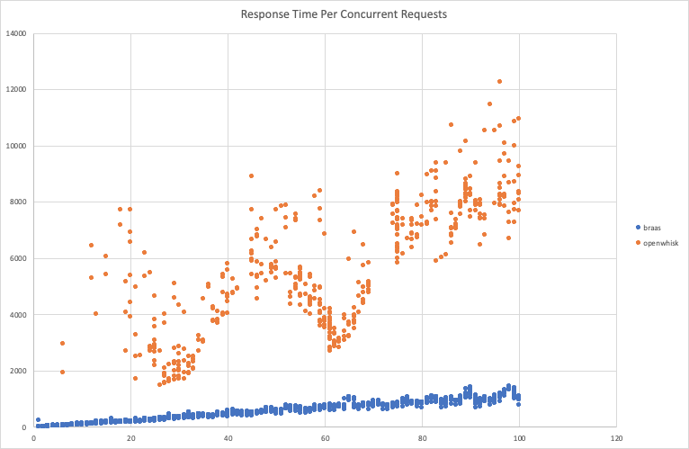
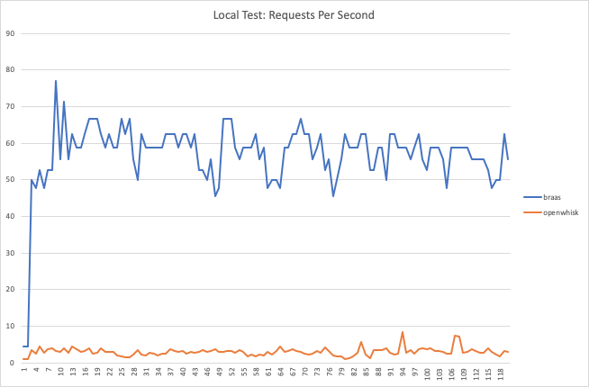

# Performance benchmarks

Due to the lightweight nature of browser tabs, using them as containers provides a significant performance boost over traditional serverless architectures, such as those that use Docker or similar containers. 

Below are the benchmark results of running a function on Browser Functions, vs running on Apache OpenWhisk, on the same hardware (MacBook Pro 2015). The blue line (braas) represents the performance of Browser Functions, vs the orange line for Apache OpenWhisk.

## Response time

<br/>
*Response time in milliseconds - lower is better*

## Concurrency

<br/>
*Concurrent requests response time - lower is better*

## Throughput

<br/>
*Throughput - higher is better*

# Web Assembly native code execution

The following function for calculating the Fibonacci sequence was compiled to a native binary (using `gcc` with default settings), and to Web Assembly using `emscripten`, and compared against a JavaScript implementation:

```c
int fib (int n) {
  if (n < 2) {
    return 1;
  }
  return fib(n - 2) + fib(n - 1);
}
```

Benchmark results for running `fib(42)` on a MacBook Pro 2015:

| Implementation| Execution time |
| ------------- |:-------------:|
| JavaScript    | 5.778 seconds |
| GCC binary    | 1.746 seconds |
| Web Assembly via Browser Functions | 1.564 seconds |

Note that the Web Assembly version running through Browser Functions is faster than running the natively compiled binary from the command line!

# GPU acceleration with WebGL

It is possible to utilize GPU hardware acceleration by making use of WebGL. Some JavaScript libraries already do this, for example [TensorFlow.js](https://www.tensorflow.org/js/) or [GPU.js](https://gpu.rocks/). Below is a comparison of multiplying two 512 x 512 matricies using CPU vs using GPU via WebGL:

